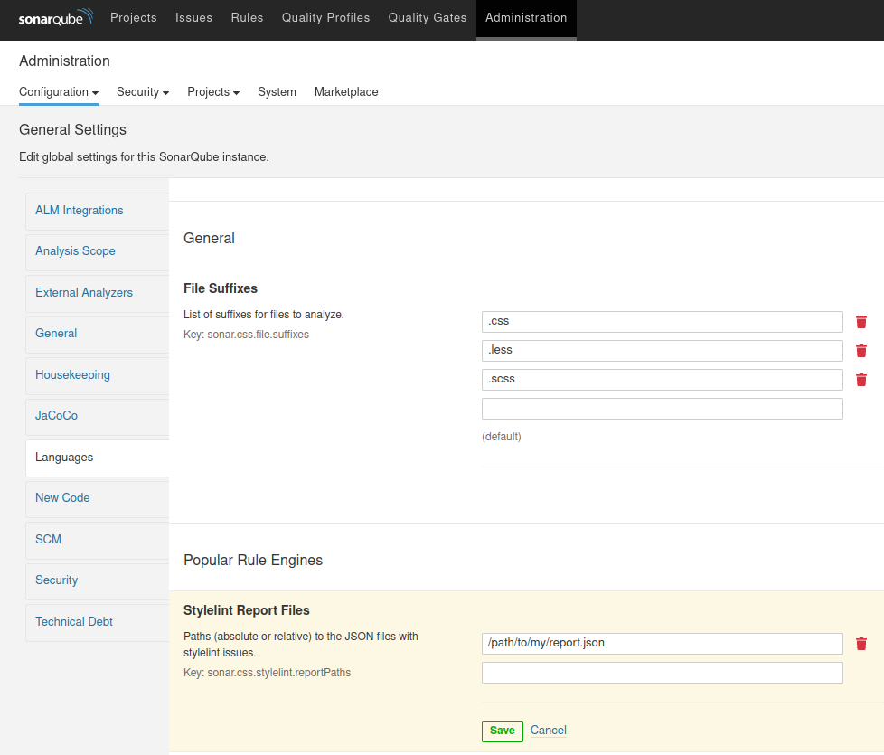

# eslint-plugin-green-it

description to b completed

## Prerequis
- Node >= 10

## Getting started

Installer les dépendances du project :

`npm i`

###Ajouter de nouvelles règles


Pour tester votre règle exécuter la commande suivante :

`npm test`

Ou bien en testant uniquement sur le fichier CSS correspondant à votre règle :

`npx stylelint ressources/MonFichierCss.css `

### Génerer et importer le rapport dans sonarqube

Considérons que vous vous trouvez dans le répertoire du projet. Exécuter la commande :

`stylelint $PATH_DU_PROJET_CIBLE -f json > stylelint-report.json`


Administration -> Configuration -> Language -> CSS



https://docs.sonarqube.org/latest/analysis/external-issues/
## Architecture

Voici un aperçu de l'architecture du projet :
```

css-linter             # Dossier racine du projet de linter JS
|
+--ressources          # Repertoire des fichiers css utilisé pour tester les règles
|  |
+--rules               # Repertoire contenant toutes les les règles
+--package.json  
\--.stylelintrc.json   # Fichier de configuration du plugin
```
